# Distributed Event-Driven Fraud Detection & Notification Pipeline

This repository contains an end-to-end distributed event streaming system built on **Apache Kafka**, integrating **Spring Boot** (Java 21) and **Rust** microservices into a real-time transaction processing and fraud alert pipeline.

---

## 🏗 System Architecture

```mermaid
flowchart LR
    A["transaction-producer<br/>(Spring Boot 3.3 / Java 21)"] -->|"JSON Transaction<br/>(key: accountId)"| T1[("transactions<br/>(3 Partitions)")]
    T1 --> B["fraud-detector<br/>(Rust / rdkafka)"]
    B -->|"Amount > $3,000<br/>FraudDetectedEvent"| T2[("fraud-detected-transactions<br/>(3 Partitions)")]
    T2 --> C["fraud-alert-streams<br/>(Kafka Streams / Spring Boot)"]
    C -->|"Enriched AlertEvent<br/>(Topology Stream)"| T3[("alerts<br/>(3 Partitions)")]
    T3 --> D["notification-service<br/>(Rust / rdkafka)"]
    D -->|"Multi-channel Dispatch<br/>(SMS, Push, Email)"| T4[("notifications<br/>(3 Partitions)")]
```



---

## 📦 Projects Overview

| # | Project | Language / Framework | Role | Input Topic | Output Topic |
|---|---|---|---|---|---|
| **1** | [`transaction-producer`](file:///home/jvalsesia/orca/workspaces/kafka-streams/skua/transaction-producer) | Java 21 / Spring Boot 3.3 / Spring Kafka | Produces 1,000 realistic transaction events on demand via REST endpoint or startup flag. Uses account-based partitioning. | — | `transactions` |
| **2** | [`fraud-detector`](file:///home/jvalsesia/orca/workspaces/kafka-streams/skua/fraud-detector) | Rust 1.98 / Tokio / rdkafka / Serde | Consumes from `transactions`, identifies fraudulent transactions exceeding `$3,000.00`, and publishes structured fraud events. | `transactions` | `fraud-detected-transactions` |
| **3** | [`fraud-alert-streams`](file:///home/jvalsesia/orca/workspaces/kafka-streams/skua/fraud-alert-streams) | Java 21 / Spring Boot 3.3 / Apache Kafka Streams | Real-time stream processing topology consuming fraud events, determining severity & mitigation actions, and publishing enriched alerts. | `fraud-detected-transactions` | `alerts` |
| **4** | [`notification-service`](file:///home/jvalsesia/orca/workspaces/kafka-streams/skua/notification-service) | Rust 1.98 / Tokio / rdkafka / Serde | Consumes alerts, dispatches multi-channel notifications (SMS, Urgent Push, Email, Security Pagers) and records notifications. | `alerts` | `notifications` |

---

## 📊 Event Schemas

### 1. `transactions`
```json
{
  "transactionId": "TX-A1B2C3D4",
  "accountId": "ACC-1042",
  "amount": 4250.75,
  "currency": "USD",
  "timestamp": "2026-09-21T15:40:35.729Z",
  "merchant": "Luxury Watches Inc",
  "category": "LUXURY_GOODS",
  "location": "New York, USA"
}
```

### 2. `fraud-detected-transactions`
```json
{
  "fraudId": "FRD-9B18EC74",
  "transactionId": "TX-A1B2C3D4",
  "accountId": "ACC-1042",
  "amount": 4250.75,
  "currency": "USD",
  "detectedAt": "2026-09-21T15:40:37.891Z",
  "reason": "Transaction amount 4250.75 USD exceeds threshold of 3000.00 USD",
  "severity": "HIGH"
}
```

### 3. `alerts`
```json
{
  "alertId": "ALT-6C48B9E2",
  "fraudId": "FRD-9B18EC74",
  "transactionId": "TX-A1B2C3D4",
  "accountId": "ACC-1042",
  "amount": 4250.75,
  "currency": "USD",
  "severity": "HIGH",
  "alertType": "HIGH_VALUE_TRANSACTION_ALERT",
  "message": "Suspicious transaction alert for account ACC-1042: Amount 4250.75 USD exceeds threshold.",
  "recommendedActions": [
    "RESTRICT_TRANSACTIONS",
    "SEND_PUSH_VERIFICATION",
    "LOG_AUDIT_TRAIL"
  ],
  "triggeredAt": "2026-09-21T15:40:37.910Z",
  "status": "ACTIVE"
}
```

### 4. `notifications`
```json
{
  "notificationId": "NOTIF-7F19E3A0",
  "alertId": "ALT-6C48B9E2",
  "fraudId": "FRD-9B18EC74",
  "accountId": "ACC-1042",
  "amount": 4250.75,
  "currency": "USD",
  "channels": ["SMS_GATEWAY", "MOBILE_PUSH", "EMAIL"],
  "subject": "[HIGH] Security Alert: Unusual Activity Detected on Account ACC-1042",
  "message": "Dear Customer, a transaction of 4250.75 USD was flagged under Alert ALT-6C48B9E2...",
  "dispatchedAt": "2026-09-21T15:40:37.925Z",
  "deliveryStatus": "SENT",
  "urgency": "HIGH"
}
```

---

## 🚀 Quick Start Guide

### Step 1: Start Kafka & Kafka UI
```bash
docker compose up -d
./scripts/init-topics.sh
```
- **Kafka Broker**: `localhost:9092`
- **Kafka UI (Web Dashboard)**: `http://localhost:8085`

---

### Step 2: Build All Projects
```bash
make build
```
Or build each individually:
- **Spring Boot apps**:
  ```bash
  cd transaction-producer && mvn clean package -DskipTests
  cd ../fraud-alert-streams && mvn clean package -DskipTests
  ```
- **Rust apps**:
  ```bash
  cargo build --manifest-path fraud-detector/Cargo.toml
  cargo build --manifest-path notification-service/Cargo.toml
  ```

---

### Step 3: Run the Services
In separate terminal tabs:

**Terminal 1 — Spring Boot Kafka Streams Alert Service:**
```bash
cd fraud-alert-streams
java -jar target/fraud-alert-streams-1.0.0.jar
# (Runs on port 8082)
```

**Terminal 2 — Rust Notification Service:**
```bash
./notification-service/target/debug/notification-service
```

**Terminal 3 — Rust Fraud Detector:**
```bash
./fraud-detector/target/debug/fraud-detector
```

**Terminal 4 — Spring Boot Transaction Producer:**
```bash
cd transaction-producer
java -jar target/transaction-producer-1.0.0.jar
# (Runs on port 8081)
```

---

### Step 4: Trigger the 1,000 Transactions Batch
Once all 4 services are running, trigger the producer via REST API:

```bash
curl -X POST "http://localhost:8081/api/transactions/trigger?count=1000"
```
Or using the provided script:
```bash
./scripts/trigger-producer.sh 1000
```

### Expected Output:
1. **Producer**: Emits 1,000 records partitioned by account ID. Returns JSON summary indicating total sent and count > $3,000.
2. **Rust Fraud Detector**: Evaluates each record in real time, filtering transactions with `amount > 3000.00` and publishing them to `fraud-detected-transactions`.
3. **Kafka Streams Alert Consumer**: Consumes each fraud event from stream topology, calculates severity level, attaches mitigation actions, and emits to `alerts`.
4. **Rust Notification Service**: Receives alerts, maps dispatch channels based on urgency, logs formatted notifications banner to stdout, and records them to `notifications`.

---

## 🔍 Verification & Health Endpoints

- **Kafka UI**: [http://localhost:8085](http://localhost:8085) (Browse topics, consumer groups, partition offsets)
- **Producer Status**: `curl http://localhost:8081/api/transactions/status`
- **Kafka Streams Health & State**: `curl http://localhost:8082/api/alerts/status`
- **Inspect Topic Message Counts**:
  ```bash
  docker exec -i kafka kafka-run-class org.apache.kafka.tools.GetOffsetShell --bootstrap-server localhost:9092 --topic transactions
  docker exec -i kafka kafka-run-class org.apache.kafka.tools.GetOffsetShell --bootstrap-server localhost:9092 --topic fraud-detected-transactions
  docker exec -i kafka kafka-run-class org.apache.kafka.tools.GetOffsetShell --bootstrap-server localhost:9092 --topic alerts
  docker exec -i kafka kafka-run-class org.apache.kafka.tools.GetOffsetShell --bootstrap-server localhost:9092 --topic notifications
  ```
