# Distributed Event-Driven Fraud Detection & Notification Pipeline

This repository contains an end-to-end distributed event streaming system built on **Apache Kafka**, integrating **Spring Boot** (Java 21) and **Rust** microservices into a real-time transaction processing, fraud detection, stream analytics, and notification pipeline.

---

## 🏗 System Architecture

```mermaid
flowchart LR
    subgraph Producers["Event Producers"]
        P1["1a. transaction-producer<br/>(Spring Boot 3.3 / Java 21)"]
        P1_RUST["1b. transaction-producer-rust<br/>(Rust 1.98 / rdkafka)"]
    end

    subgraph Cluster["Kafka Cluster"]
        subgraph Broker["Kafka Broker (KRaft Node 1)"]
            direction TB
            T1["Topic: transactions<br/>[ Partition 0 ] &nbsp;|&nbsp; [ Partition 1 ] &nbsp;|&nbsp; [ Partition 2 ]"]
            T2["Topic: fraud-detected-transactions<br/>[ Partition 0 ] &nbsp;|&nbsp; [ Partition 1 ] &nbsp;|&nbsp; [ Partition 2 ]"]
            T3["Topic: alerts<br/>[ Partition 0 ] &nbsp;|&nbsp; [ Partition 1 ] &nbsp;|&nbsp; [ Partition 2 ]"]
            T4["Topic: notifications<br/>[ Partition 0 ] &nbsp;|&nbsp; [ Partition 1 ] &nbsp;|&nbsp; [ Partition 2 ]"]
            T1 ~~~ T2 ~~~ T3 ~~~ T4
        end
    end

    P2["2. fraud-detector<br/>(Rust / rdkafka)"]
    P3["3. fraud-alert-streams<br/>(Spring Boot / Kafka Streams)"]
    P4["4. notification-service<br/>(Rust / rdkafka)"]

    P1 -->|"REST API Trigger<br/>key: accountId"| T1
    P1_RUST -->|"Native CLI Batch<br/>key: accountId"| T1
    T1 -->|"Consume transactions"| P2
    P2 -->|"Amount > 3,000<br/>FraudDetectedEvent"| T2
    T2 -->|"Topology stream<br/>process & enrich"| P3
    P3 -->|"Enriched AlertEvent"| T3
    T3 -->|"Consume alerts"| P4
    P4 -->|"Multi-channel dispatch<br/>record event"| T4
```



---

## 📦 Projects Overview

| # | Project | Language / Framework | Role | Input Topic | Output Topic |
|---|---|---|---|---|---|
| **1a** | [`transaction-producer`](file:///home/jvalsesia/orca/workspaces/kafka-streams/skua/transaction-producer) | **Java 21** / Spring Boot 3.3 / Spring Kafka | Web service providing REST endpoints (`POST /api/transactions/trigger?count=1000`) and CLI runners to emit realistic transaction events partitioned by `accountId`. | — | `transactions` |
| **1b** | [`transaction-producer-rust`](file:///home/jvalsesia/orca/workspaces/kafka-streams/skua/transaction-producer-rust) | **Rust 1.98** / `rdkafka` / `tokio` / `clap` | High-throughput native CLI transaction generator. Emits configurable batches (`--count 1000`) or continuous streams with rate limiting (`--delay-ms`). | — | `transactions` |
| **2** | [`fraud-detector`](file:///home/jvalsesia/orca/workspaces/kafka-streams/skua/fraud-detector) | **Rust 1.98** / `rdkafka` / `tokio` / `serde` | Real-time stream consumer on `transactions`. Evaluates transactions against a `$3,000.00` fraud threshold and publishes structured [`FraudDetectedEvent`](file:///home/jvalsesia/orca/workspaces/kafka-streams/skua/fraud-detector/src/models.rs) records. | `transactions` | `fraud-detected-transactions` |
| **3** | [`fraud-alert-streams`](file:///home/jvalsesia/orca/workspaces/kafka-streams/skua/fraud-alert-streams) | **Java 21** / Spring Boot 3.3 / **Kafka Streams** | Apache Kafka Streams topology consuming from `fraud-detected-transactions`. Enriches events, computes severity (`CRITICAL`, `HIGH`, `MEDIUM`), attaches mitigation actions, and streams alerts. | `fraud-detected-transactions` | `alerts` |
| **4** | [`notification-service`](file:///home/jvalsesia/orca/workspaces/kafka-streams/skua/notification-service) | **Rust 1.98** / `rdkafka` / `tokio` / `serde` | Multi-channel notification dispatcher consuming from `alerts`. Simulates dispatches to SMS, Urgent Mobile Push, Email, and Security Pagers, outputting audit records to Kafka. | `alerts` | `notifications` |

---

## 🗂 Kafka Topic & Partition Architecture

All topics are provisioned with **3 partitions** inside the single KRaft broker:

```text
┌────────────────────────────────────────────────────────────────────────────────────────┐
│                                    KAFKA CLUSTER                                       │
│ ┌────────────────────────────────────────────────────────────────────────────────────┐ │
│ │                         KAFKA BROKER (KRaft Node 1 - 9092)                         │ │
│ │                                                                                    │ │
│ │  Topic: transactions                [ Partition 0 ] [ Partition 1 ] [ Partition 2 ]│ │
│ │  Topic: fraud-detected-transactions [ Partition 0 ] [ Partition 1 ] [ Partition 2 ]│ │
│ │  Topic: alerts                      [ Partition 0 ] [ Partition 1 ] [ Partition 2 ]│ │
│ │  Topic: notifications               [ Partition 0 ] [ Partition 1 ] [ Partition 2 ]│ │
│ └────────────────────────────────────────────────────────────────────────────────────┘ │
└────────────────────────────────────────────────────────────────────────────────────────┘
```

- **Partition Key**: Every event uses `accountId` as the partition key.
- **Ordering Guarantee**: Murmur2 hashing maps all events for a given account to the same partition, guaranteeing strict FIFO event ordering across the entire pipeline.
- **Scalability**: Enables up to 3 concurrent parallel stream processing threads per topic.

---

## 📊 Event Schemas

### 1. `transactions`
```json
{
  "transactionId": "TX-A1B2C3D4",
  "accountId": "ACC-1042",
  "amount": 4250.75,
  "currency": "USD",
  "timestamp": "2026-09-21T15:40:35.729Z",
  "merchant": "Luxury Watches Inc",
  "category": "LUXURY_GOODS",
  "location": "New York, USA"
}
```

### 2. `fraud-detected-transactions`
```json
{
  "fraudId": "FRD-9B18EC74",
  "transactionId": "TX-A1B2C3D4",
  "accountId": "ACC-1042",
  "amount": 4250.75,
  "currency": "USD",
  "detectedAt": "2026-09-21T15:40:37.891Z",
  "reason": "Transaction amount 4250.75 USD exceeds threshold of 3000.00 USD",
  "severity": "HIGH"
}
```

### 3. `alerts`
```json
{
  "alertId": "ALT-6C48B9E2",
  "fraudId": "FRD-9B18EC74",
  "transactionId": "TX-A1B2C3D4",
  "accountId": "ACC-1042",
  "amount": 4250.75,
  "currency": "USD",
  "severity": "HIGH",
  "alertType": "HIGH_VALUE_TRANSACTION_ALERT",
  "message": "Suspicious transaction alert for account ACC-1042: Amount 4250.75 USD exceeds threshold.",
  "recommendedActions": [
    "RESTRICT_TRANSACTIONS",
    "SEND_PUSH_VERIFICATION",
    "LOG_AUDIT_TRAIL"
  ],
  "triggeredAt": "2026-09-21T15:40:37.910Z",
  "status": "ACTIVE"
}
```

### 4. `notifications`
```json
{
  "notificationId": "NOTIF-7F19E3A0",
  "alertId": "ALT-6C48B9E2",
  "fraudId": "FRD-9B18EC74",
  "accountId": "ACC-1042",
  "amount": 4250.75,
  "currency": "USD",
  "channels": [
    "SMS_GATEWAY",
    "MOBILE_PUSH",
    "EMAIL"
  ],
  "subject": "[HIGH] Security Alert: Unusual Activity Detected on Account ACC-1042",
  "message": "Dear Customer, a transaction of 4250.75 USD was flagged under Alert ALT-6C48B9E2...",
  "dispatchedAt": "2026-09-21T15:40:37.925Z",
  "deliveryStatus": "SENT",
  "urgency": "HIGH"
}
```

---

## 🚀 Quick Start Guide

### Step 1: Start Kafka & Kafka UI
Launch the Kafka KRaft broker and Kafka UI web dashboard:
```bash
docker compose up -d
./scripts/init-topics.sh
```
- **Kafka Broker**: `localhost:9092`
- **Kafka UI Console**: [http://localhost:8085](http://localhost:8085)

---

### Step 2: Build All Projects
Build both Spring Boot applications and all three Rust applications in one command:
```bash
make build
```

Or build individually:
- **Spring Boot apps**:
  ```bash
  cd transaction-producer && mvn clean package -DskipTests
  cd ../fraud-alert-streams && mvn clean package -DskipTests
  ```
- **Rust apps**:
  ```bash
  cargo build --manifest-path transaction-producer-rust/Cargo.toml
  cargo build --manifest-path fraud-detector/Cargo.toml
  cargo build --manifest-path notification-service/Cargo.toml
  ```

---

### Step 3: Run the Pipeline Services
Open 4 separate terminal tabs to run the processing pipeline:

**Terminal 1 — Spring Boot Kafka Streams Consumer (Port 8082):**
```bash
cd fraud-alert-streams
java -jar target/fraud-alert-streams-1.0.0.jar
# or: make run-streams
```

**Terminal 2 — Rust Notification Service:**
```bash
./notification-service/target/debug/notification-service
# or: make run-notif
```

**Terminal 3 — Rust Fraud Detector Engine:**
```bash
./fraud-detector/target/debug/fraud-detector
# or: make run-fraud
```

**Terminal 4 — Spring Boot Transaction Producer (Port 8081):**
```bash
cd transaction-producer
java -jar target/transaction-producer-1.0.0.jar
# or: make run-producer
```

---

### Step 4: Trigger Transactions

You can generate transactions using **either** producer:

#### Option A — Via Rust CLI Producer (High Throughput):
```bash
# Generate 1,000 transactions at max speed
cargo run --manifest-path transaction-producer-rust/Cargo.toml -- --count 1000
# or with Makefile shortcut:
make run-producer-rust

# Continuous streaming mode with 50ms delay between events:
cargo run --manifest-path transaction-producer-rust/Cargo.toml -- --continuous --delay-ms 50
```

#### Option B — Via Spring Boot REST API Producer:
```bash
curl -X POST "http://localhost:8081/api/transactions/trigger?count=1000"
# or with shell script:
./scripts/trigger-producer.sh 1000
```

---

### 📋 Expected Pipeline Flow

1. **Producer**: Emits 1,000 transaction events to `transactions` across the 3 partitions (approx. 35% with amount > $3,000).
2. **Rust Fraud Detector**: Evaluates incoming events in real time. Flagged transactions (> $3,000) are wrapped into a `FraudDetectedEvent` and published to `fraud-detected-transactions`.
3. **Kafka Streams Alert Processor**: Consumes fraud events from the topology stream, determines severity, maps mitigation actions, and emits an `AlertEvent` to `alerts`.
4. **Rust Notification Dispatcher**: Receives alerts from `alerts`, displays a formatted notification banner in console, and records dispatched notification records to `notifications`.

---

## 🛠 Makefile Reference

| Command | Action |
|---|---|
| `make up` | Starts the Kafka KRaft broker and Kafka UI via Docker Compose |
| `make down` | Stops the Kafka containers |
| `make init-topics` | Initializes the 4 Kafka topics with 3 partitions each |
| `make build` | Compiles and packages all Spring Boot and Rust applications |
| `make run-producer` | Starts the Spring Boot transaction producer (Port 8081) |
| `make run-producer-rust` | Runs the Rust transaction producer (emits 1,000 events) |
| `make run-fraud` | Starts the Rust fraud detection service |
| `make run-streams` | Starts the Spring Boot Kafka Streams alert service (Port 8082) |
| `make run-notif` | Starts the Rust multi-channel notification dispatcher |
| `make test-1000` | Triggers production of 1,000 transactions via REST script |
| `make clean` | Cleans target and build directories for all projects |

---

## 🔍 Verification & Health Endpoints

- **Kafka UI Console**: [http://localhost:8085](http://localhost:8085) (Live topics, messages, consumer lag, broker metrics)
- **Producer Status**: `curl http://localhost:8081/api/transactions/status`
- **Kafka Streams Health & Topology State**: `curl http://localhost:8082/api/alerts/status`
- **Inspect Topic Partition Offsets**:
  ```bash
  docker exec -i kafka kafka-run-class org.apache.kafka.tools.GetOffsetShell --bootstrap-server localhost:9092 --topic transactions
  docker exec -i kafka kafka-run-class org.apache.kafka.tools.GetOffsetShell --bootstrap-server localhost:9092 --topic fraud-detected-transactions
  docker exec -i kafka kafka-run-class org.apache.kafka.tools.GetOffsetShell --bootstrap-server localhost:9092 --topic alerts
  docker exec -i kafka kafka-run-class org.apache.kafka.tools.GetOffsetShell --bootstrap-server localhost:9092 --topic notifications
  ```
